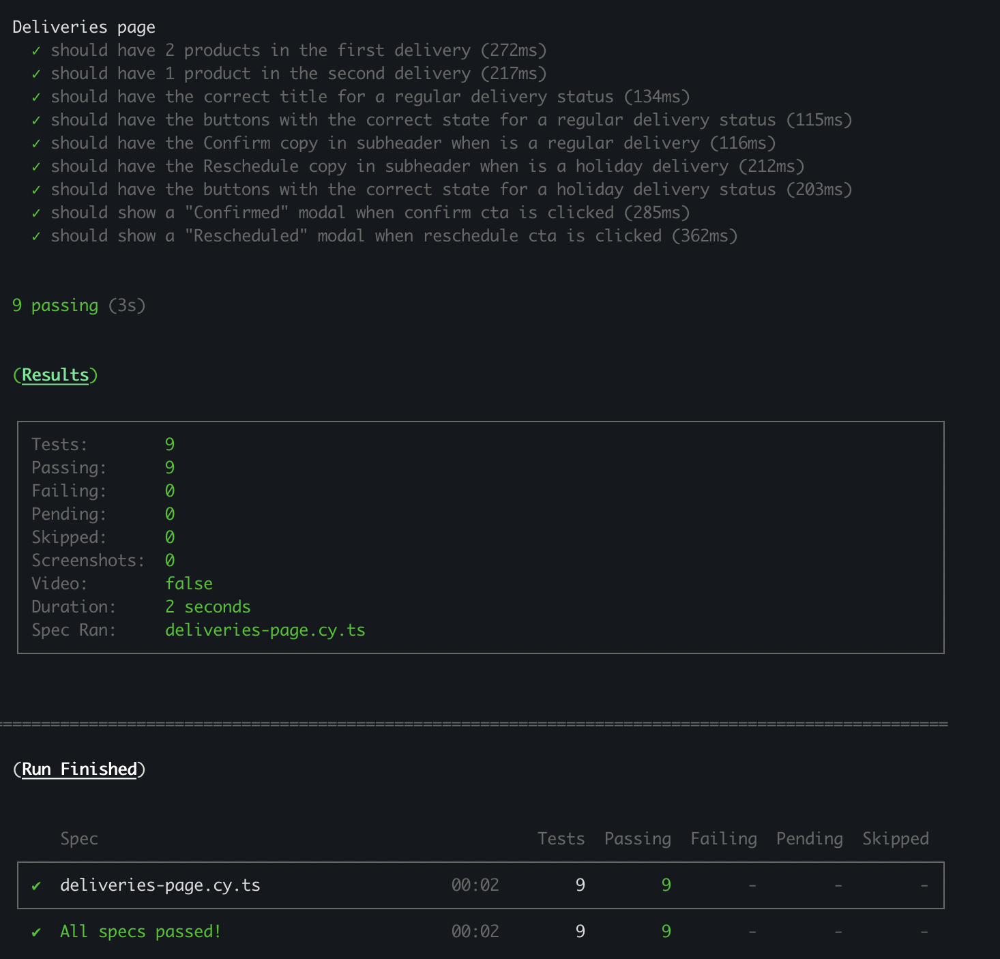
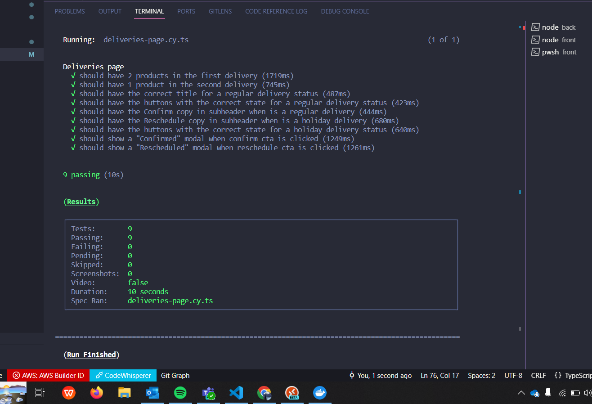

# CookUnity Sr. Full Stack challange

## Backend Overview and Setup
<details><summary><b> (1) Docker Compose for PostgreSQL and pgAdmin
</b></summary>
<p>
This project uses the following Docker Compose configuration to set up two containers: one for PostgreSQL and another for pgAdmin.

1. PostgreSQL Container:
    * Container Name: **postgresql_db**
    * Image: Official PostgreSQL Docker image
    * Environment Variables:
        * **POSTGRES_USER**: postgres
        * **POSTGRES_PASSWORD**: mysecretpassword
        * **POSTGRES_DB**: postgres
    * Ports:
        * Localhost:5432 maps to Container:5432
2. pgAdmin Container:
    * Container Name: **pgadmin4**
    * Image: dpage/pgadmin4
    * Environment Variables:
        * **PGADMIN_DEFAULT_EMAIL**: root@root.com
        * **PGADMIN_DEFAULT_PASSWORD**: root
    * Ports:
        * Localhost:5050 maps to Container:80
3. Network Configuration:
    * PostgreSQL container IP: 192.168.0.2
    * pgAdmin container IP: 192.168.0.3

Ensure you have Docker and Docker Compose installed on your machine. Then run the following command to start the containers in the background: 
```bash
cd /back
npm install
docker-compose up
```
Access pgAdmin by navigating to http://localhost:5050 in your web browser. Log in with the email: root@root.com and password: root.

</p>
</details>

<details><summary><b> (2) Database Migration Instructions </b></summary>
<p>
This project uses TypeORM for managing database migrations. Follow the steps below to set up and run migrations:

1. Prerequisites
    * Docker should be running, as the database migrations require an active database connection.

2. Installation
```bash
cd /back
npm install
```
3. Generate Migration
```bash
npm run migration:generate -- src/db/migrations/SchemaMigration
```
4. Update Migration with Data
    * Navigate to the generated migration file, located at **src/db/migrations/SchemaMigration.ts**. In this file, find the up method, and insert the following code:

```typescript 
// src/db/migrations/SchemaMigration.ts

public async up(queryRunner: QueryRunner): Promise<void> {
    // Existing migration queries...

    // Insert products
    await queryRunner.query(`INSERT INTO public.products(id, name, description, image, price, created_at, updated_at)
    VALUES 
    (1, 'Chicken Alfredo', 'Creamy pasta with grilled chicken', 'https://hips.hearstapps.com/hmg-prod/images/delish-221130-perfect-chicken-alfredo-0689-eb-1670449996.jpg?crop=1.00xw:0.737xh;0,0.134xh&resize=360:*', 15.79, NOW(), NOW()), 
    (2, 'Grilled Salmon', 'Healthy salmon fillet with herbs', 'https://hips.hearstapps.com/del.h-cdn.co/assets/18/11/1600x1600/square-1520957481-grilled-salmon-horizontal.jpg?resize=360:*', 18.75, NOW(), NOW()), 
    (3, 'Vegetarian Pizza', 'Fresh vegetables on a crispy crust', 'https://hips.hearstapps.com/hmg-prod/images/picture1-1563214531.png?crop=0.5810055865921788xw:1xh;center,top&resize=360:*', 14.50, NOW(), NOW()),
    (4, 'Caesar Salad', 'Classic Caesar salad with grilled chicken', 'https://hips.hearstapps.com/hmg-prod/images/chicken-caesar-salad7-1654809005.jpg?crop=0.590xw:0.880xh;0.0497xw,0.120xh&resize=360:*', 12.25, NOW(), NOW()),
    (5, 'Margherita Pizza', 'Traditional pizza with tomato, mozzarella, and basil', 'https://hips.hearstapps.com/delish/assets/cm/15/10/54f95ec028a68_-_pizza-del0814-def.png?crop=1.00xw:1.00xh;0,0&resize=360:*', 11.99, NOW(), NOW())`);

    // Insert deliveries
    await queryRunner.query(`INSERT INTO public.deliveries(id, "timeExpected", status, created_at, updated_at)
    VALUES 
    (1, '2024-12-25 18:38:45.687563', 'not confirmed', NOW(), NOW()),
    (2, '2024-02-20 18:38:45.687563', 'not confirmed', NOW(), NOW()),
    (3, '2024-07-04 18:38:45.687563', 'not confirmed', NOW(), NOW())`);

    // Insert delivery items
    await queryRunner.query(`INSERT INTO public.delivery_items(id, price, delivery_id, product_id, created_at, updated_at)
    VALUES 
    (1, 16.8, 1, 1, NOW(), NOW()),
    (2, 18.75, 1, 2, NOW(), NOW()),
    (3, 15, 2, 3, NOW(), NOW()),
    (4, 11.99, 2, 5, NOW(), NOW()),
    (5, 12, 3, 4, NOW(), NOW())`);

    // More migration queries...
}
```

5. Run Migration
* Once you've added your data migration queries, run the migration with the following command:

```bash
npm run migration:run
```
* This command will execute the migrations and apply the changes to the database. 

Ensure that your Docker container is up and running to successfully apply the schema and data changes.

</p>
</details>

## Backend Setup
Create a .env file and fill it with the following variables

| NAME | VALUE |
|------|-------|
| **EXPRESS_PORT** | 3000
| **POSTGRES_USER** | postgres
| **POSTGRES_PASSWORD** | mysecretpassword
| **POSTGRES_DB** | postgres


Before running the migration, read the "Database Migration Instructions" section to populate the databse.

```bash
cd /back
npm install
docker-compose up
npm run migration:generate -- src/db/migrations/SchemaMigration
#Don't forget to populate the database
npm run migration:run
npm run dev
```

## Frontend Overview

```bash
cd /front
npm install
npm run dev
```

## Instructions

Required

- Make the tests passes.

```bash
# start back and front dev servers then
cd /front
npm run tests
```

Optional

- Feel free to improve/refactor/add/remove anything you like in the existent code.

## Expected Result

A visual preview always helps to understand the task.

<video width="100%" height="300" src="./challenge-evidence.mp4"></video>



## Results


